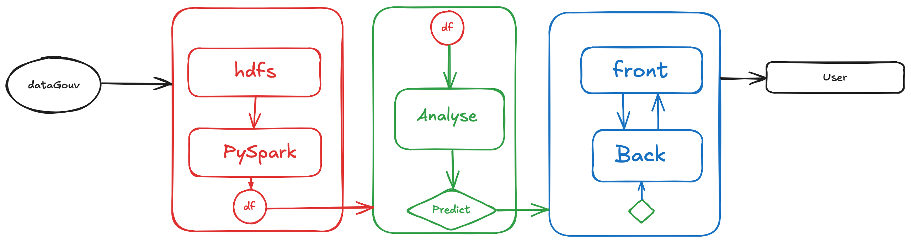

# SoGood — Analyse Nutritionnelle des Produits de Supermarché

**SoGood** est une plateforme open data interactive destinée à analyser, prédire et cartographier la qualité nutritionnelle des produits alimentaires issus de supermarchés. Elle vise à mieux informer les consommateurs et soutenir les décisions de santé publique.

## Objectifs du projet

- Évaluer la qualité nutritionnelle des produits : **Nutri-Score, NOVA, taux de sucre, sel, additifs...**
- Identifier les **produits et marques controversés**
- Prédire automatiquement le **Nutri-Score** ou le **NOVA score** via un modèle 
- Proposer une **web app interactive** avec filtres, recherche, visualisations,Scanner un code-barres, Analyse d’ingrédients, API, etc...

---

## Stack technique

- **Front-end** : React.js + MUI
- **Back-end** : FastAPI (Python)
- **Traitement Big Data** : PySpark sur HDFS
- **Containerisation** : Docker / Docker Compose


---

## Démarrage du projet

### 1. Cloner le dépôt

```bash
git clone https://github.com/Berenger2/nutri-score
cd nutri-score
```
### 2. Lancer l’environnement via Docker
```bash
docker-compose up --build 
```


| Service                 | Description                         | URL d’accès                                              | Port container |
| ----------------------- | ----------------------------------- | -------------------------------------------------------- | -------------- |
| **Frontend**            | Interface React + MUI               | [http://localhost:3000](http://localhost:3000)           | 80             |
| **Backend API**         | FastAPI + Swagger UI                | [http://localhost:8000/docs](http://localhost:8000/docs) | 8000           |
| **Dozzle**              | Visualisation des logs containers   | [http://localhost:8082](http://localhost:8082)           | 8080 (int.)    |
| **HDFS NameNode**       | UI de gestion du NameNode Hadoop    | [http://localhost:9870](http://localhost:9870)           | 9870           |
| **HDFS DataNode**       | Monitoring du DataNode Hadoop       | [http://localhost:9864](http://localhost:9864)           | 9864           |
| **Spark Master**        | Interface Spark Master              | [http://localhost:8080](http://localhost:8080)           | 8080           |
| **Spark Worker**        | Interface Spark Worker 1            | [http://localhost:8081](http://localhost:8081)           | 8081           |

---
## Structure du projet

```text
.
├── back/               → API FastAPI 
├── front/              → App React 
├── datas/              → Datasets sample
├── data_analyse/       → Explorations, modèles 
├── spark-master/       → Config Spark master
├── docker-compose.yml  → Configuration des services

